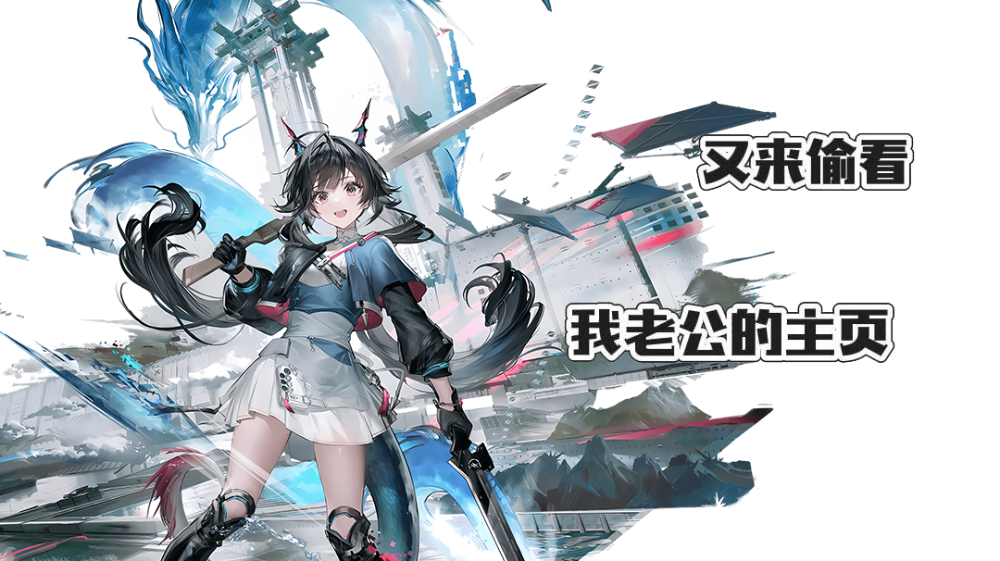

## 欢迎！欢迎！我们欢迎！

!!! abstract "Hello"

    这里是 Kihana 的个人博客

    主要记录一些学习与生活中的点滴

    感谢您的浏览

## 重复访问者计数
  

### 本站共有 {{ pages }} 个页面，{{ words }} 个字，{{ images }} 张图片
## 关于我
- 本科生在读
- 目前主修方向是摸鱼
- 喜欢浪费时间折腾各种不切实际的东西
- ~~最近在折腾MMD与blender等各种东西~~
- 兴趣太广不管什么都想试试
- 硬着头皮写出来一堆bug，最终还不如AI一分钟生成
- 因为不熟悉Github而折腾了很长时间个人博客的笨蛋
- 喜欢宅的家里蹲

[友链 :material-gamepad-variant-outline:](friend.md){ .md-button .md-button--primary }                     [标签 :material-tag-outline:](tags.md){ .md-button }  
==近期想要添加的功能==  
- js鼠标美化  
- 从tags开始的可视化标签云图生成  
- 利用js支撑的博客看板娘计划  
- 修订博客的时间戳问题  
- 丰富字体配置，提升博客美观度  

