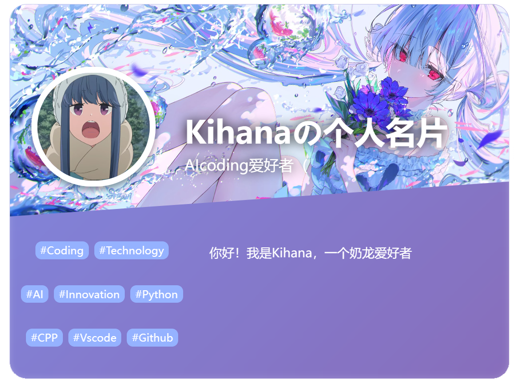

<section class="home-hero" aria-labelledby="home-title">
  

    
Kihana's Blog · 学习 / 生活 / 折腾

    <h1 id="home-title">欢迎来到我的小站。</h1>
    
拾起日常的微光，记录学习中的问题与发现，也写下偶尔冒出来的奇思妙想。

    

      <a class="home-action home-action--primary" href="blog/">开始阅读 ↗</a>
      <a class="home-action" href="toc/">文章归档</a>
    

  

  
</section>

  

    
EXPLORE

    <h2>从这里开始</h2>
  

  
按主题找文章，或者留下你的想法。

  <a class="home-link" href="blog/">
    ✦
    <strong>全部文章</strong>
    学习日志、问题记录与生活片段
    ↗
  </a>
  <a class="home-link" href="tags/">
    #
    <strong>按标签找</strong>
    顺着感兴趣的话题继续阅读
    ↗
  </a>
  <a class="home-link" href="friend/">
    ♡
    <strong>友链与留言</strong>
    欢迎来串门，也欢迎交换友链
    ↗
  </a>

<section class="home-about" aria-labelledby="home-about-title">
  

    
ABOUT ME

    <h2 id="home-about-title">关于我</h2>
    
计算机类本科生在读，主修方向是摸鱼，兴趣方向则常常跑得比计划还快。

    
喜欢折腾各种不切实际的东西，也喜欢把踩过的坑写下来。这个博客是我的学习日志、问题备忘录和生活角落。

    <a href="contact/">在留言板打个招呼 →</a>
  

  
</section>

  本站共有 {{ pages }} 个页面、{{ words }} 个字、{{ images }} 张图片。
  

{{ github_heatmap }}
